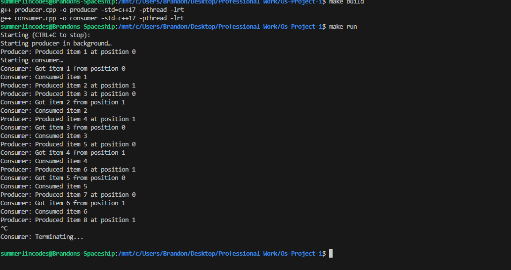

# Os-Project-1

## Description
Producer and Consumer problem implementation for Kent State University Operating Systems class.

This project demonstrates the classic producer-consumer problem using:
- Shared memory between two processes
- Semaphores for synchronization
- Threads in both producer and consumer programs
- A table that can hold two items at a time

## Prerequisites
- Linux or WSL environment
- G++ (C++17) with pthreads and POSIX shared-memory support
- make utility

## Usage
Two ways to compile and run:

1. **Using Makefile**:
   - Type `make build` to compile
   - Type `make run` to execute both programs, CTRL + C to stop
   - Type `make cleanup` to clear any leftover shared memory or semaphores
   - This assumes you have make installed.

2. **Manual way**:
   - Type `g++ consumer.cpp -o consumer -lrt -pthread`
   - Type `g++ producer.cpp -o producer -lrt -pthread`
   - To run the program, type: `./producer & ./consumer &` # run both in background

## Implementation Details
- The producer generates items and puts them on the table
- The consumer picks up items from the table
- The table can only hold two items at a time
- When the table is full, the producer waits
- When the table is empty, the consumer waits
- Semaphores are used for synchronization
- Shared memory is used for the "table"

## Example Output

- Screenshot demonstrating the producer-consumer synchronization in action
